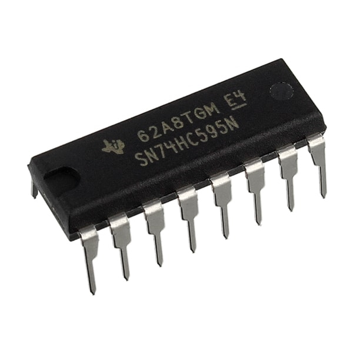
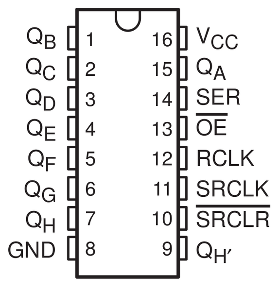

74HC595 8bit Shift Register
===========================

Python files for controlling the 74HC595 shift register on the Beaglebone Black.

| Chip pin name  | Chip pin  | Beaglebone Black and/or pin name or NOTE           |
|----------------|-----------| ---------------------------------------------------|
| QB             | 1         | LED 2                                              |
| QC             | 2         | LED 3                                              |
| QD             | 3         | LED 4                                              |
| QE             | 4         | LED 5                                              |
| QF             | 5         | LED 6                                              |
| QG             | 6         | LED 7                                              |
| QH             | 7         | LED 8                                              |
| GND            | 8         | External Power 5v Neg. *(Must be shared with BBB)  |
| QH'            | 9         | Single Not Used, Daisy Chain Pin14(SER) on next IC |
| SRCLR          | 10        | P9\_5, VDD 5v or External 5v POS.                  |
| SRCLK          | 11        | P9\_27, GPIO                                       |
| RCLK           | 12        | P9\_25, GPIO                                       |
| OE             | 13        | P9\_1, Ground or External 5v GND.                  |
| SER            | 14        | P9\_23, GPIO                                       |
| QA             | 15        | LED 1                                              |
| VCC            | 16        | External Power 5v Pos.                             |

NOTE: Using an external power source is recommended to drive the circuits you must
connect the negative from the Beaglebone Black to the negative rale of the external
power source in order for the lagistics to work properly with the shift register/s.

NOTE: Pin 10 'SRCLR' is (Clear), set High for normal operation and set Low to clear
all bits from the register. This pin could be controled by the BBB GPIO pins

NOTE: Pin 13 'OE' is (Output Enable), set Low for normal operation and set High to
trun off all LED's but register remains intact. This pin could be controled by
the BBB GPIO pins

